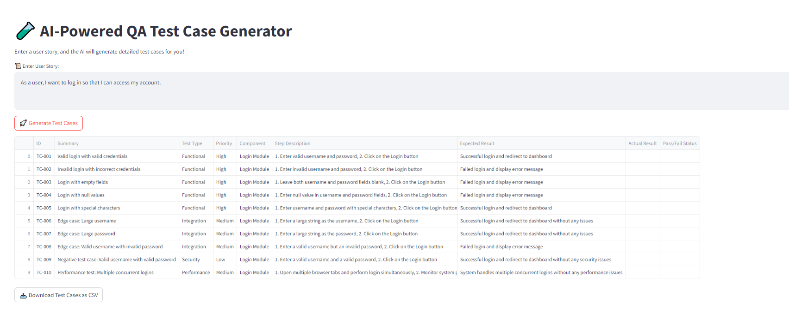

# AI-Powered QA Test Case Generator

This repository contains an AI-powered application that generates detailed test cases from user stories using **Autogen Agents** and **Streamlit**. The app helps developers automate the process of writing test cases for functional, regression, integration, performance, and security testing, making it easier to ensure comprehensive software quality.



## Features

- **Generates detailed test cases** from a simple user story.
- **Includes functional, edge cases, and negative test cases**.
- **Supports multiple types of testing**: Functional, Regression, Integration, Performance, and Security.
- **AI-driven test case generation** powered by **Autogen Agents**.
- **Download test cases as CSV** for further use.
- **Streamlit UI** for an interactive user experience.

## How It Works

1. Enter a **user story** describing a feature or requirement.
2. The **User Proxy Agent** communicates with the **QA Agent** to generate detailed test cases.
3. The **QA Agent** returns structured test cases, including functional, regression, integration, performance, and security aspects.
4. Test cases are displayed in a **Streamlit DataFrame** for easy viewing.
5. You can download the generated test cases as a CSV file for further testing.

## Installation

To run this application locally, you'll need to install the required dependencies.

### Prerequisites

- Python 3.7 or higher
- pip (Python package installer)
- **Ollama** and **Llama 3.2** need to be installed on your local server to test this application.

### Steps to Install

1. Clone this repository:

```bash
git clone https://github.com/karthigamuthuraj/ai-qa-test-case-generator.git
cd ai-qa-test-case-generator.git
```

2. Install **Ollama** and **Llama 3.2**:
    - To install **Ollama**:
    
    ```bash
    curl -sSL https://ollama.com/install.sh | bash
    ```
    - Install **Llama 3.2** model:
    
    ```bash
    ollama pull llama3.2
    ```

3. Create a virtual environment (optional but recommended):

```bash
python -m venv venv
source venv/bin/activate  # On Windows: venv\Scriptsctivate
```

4. Install the required dependencies:

```bash
pip install -r requirements.txt
```

5. Run the Streamlit app:

```bash
streamlit run QA_Agent_Llama.py
```

## Usage

- Open the application in your browser (usually at `http://localhost:8501`).
- Enter a **user story** in the provided text area.
- Click on **Generate Test Cases** to receive detailed test cases from the AI.
- Review the test cases in the displayed table.
- Optionally, download the test cases as a **CSV** file for further use.

## Technologies Used

- **Streamlit**: A framework for building interactive web applications in Python.
- **Autogen Agents**: AI agents for automating complex tasks.
- **Python**: The programming language used for this app.
- **Pandas**: For data manipulation and CSV export.
- **simplejson**: For JSON parsing and handling.

## Acknowledgements

- **Streamlit** for building interactive applications with Python.
- **Autogen** for AI-powered task automation.
- **Ollama** for enabling local AI model usage.

